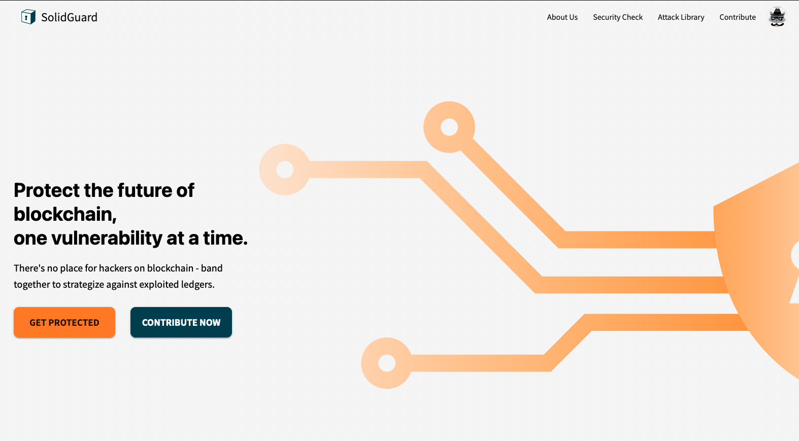
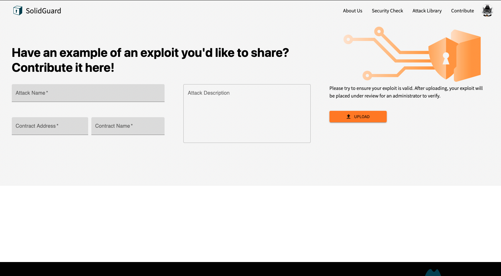
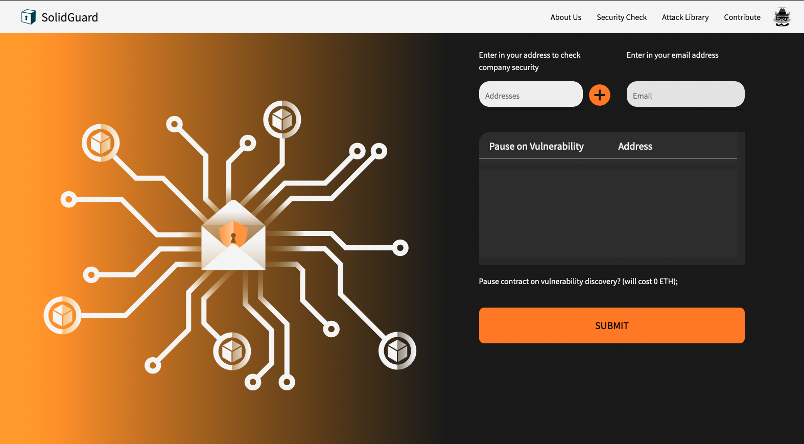

  

    
  

<h1>SolidGuard</h1>

**Version**: `v1.0.4`

SolidGuard is a Blockchain Security tool catered towards organizations who manages decentralized applications on the Ethereum blockchain. It is an attack database for documenting all major hacks that happened in the blockchain, and is also used to notify or pause decentralized applications that contain vulnerabilities published in the database.

This repository contains everything needed to run the server (minus the prerequisites)!

## Preview

## Deployment
To learn more on deploying the entire application via docker-compose, see [deploy.md](./docs/deploy.md).

## Contribute
To learn more on how to contribute to this repository, see [contribute.md](./docs/contribute.md).

## Credits
* **Lead Software Engineer:** Jan Garong.
* **Lead Designer:** Angela Shen.
* **Graphic Designers:** Amy Li, Jackie.
* **Frontend Engineers:** Vivek Kandathil, Peter Pham, Glenn Ye.
* **Backend Engineers:** Meixuan (Mexi) Lu, Ruo Ning (Nancy) Qiu.
* **DevOps Engineers:** Si (Leo) Wang, Stephen Guo.
